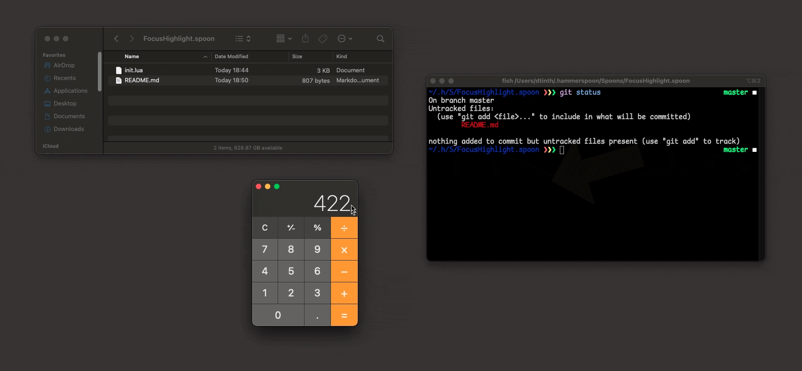

# FocusHighlight.spoon

Briefly highlights the active window. Useful when switching between multiple displays.



It is implemented as [a Spoon for Hammerspoon](https://github.com/Hammerspoon/hammerspoon/blob/master/SPOONS.md). You can [customize](#customize) the color of the highlight.

## How to use

1. [Install Hammerspoon](https://www.hammerspoon.org/go/)

2. Install FocusHighlight.spoon using Git:

    ```sh
    git clone https://github.com/dtinth/FocusHighlight.spoon.git ~/.hammerspoon/Spoons/FocusHighlight.spoon
    ```

3. Update Hammerspoon configuration file:

    ```lua
    hs.loadSpoon("FocusHighlight")
    spoon.FocusHighlight:start()
    ```

## Customization

Put these in your configuration file.

```lua
spoon.FocusHighlight.color = "#ffffff"
spoon.FocusHighlight.windowFilter = hs.window.filter.default
spoon.FocusHighlight.arrowSize = 256
```